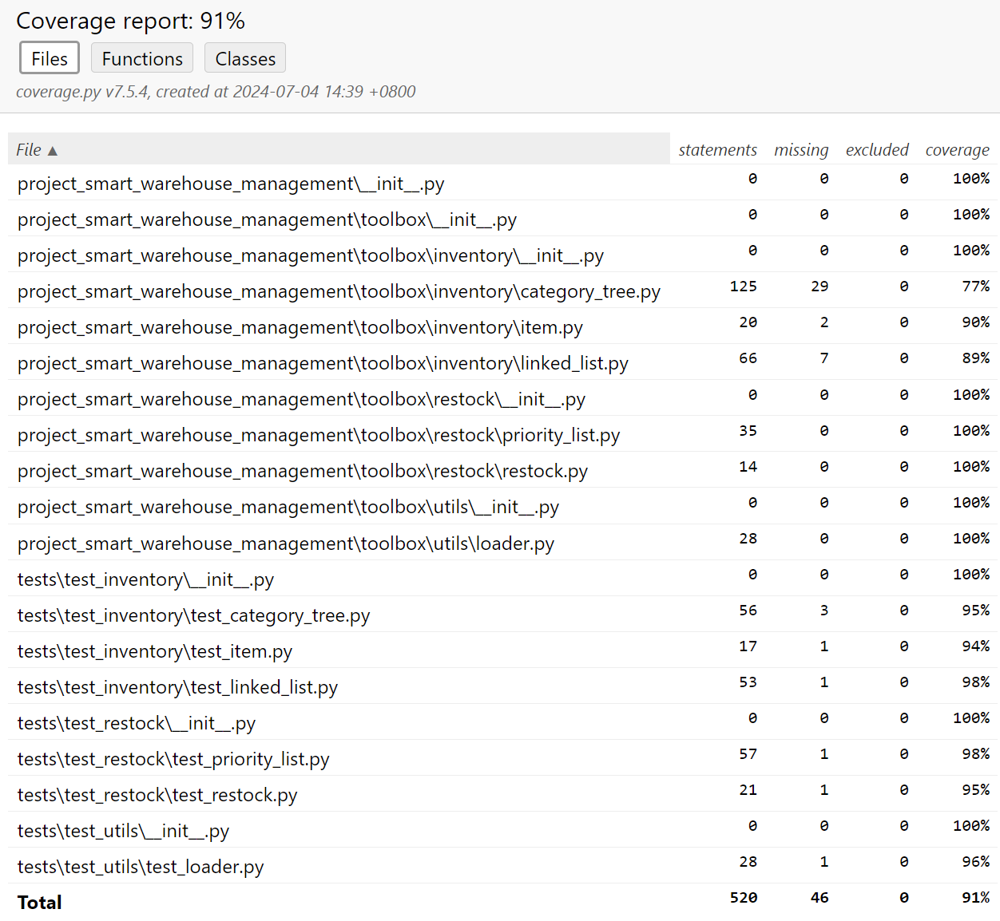

# Project 5 - Smart Warehouse Management System

## 1.Project Overview

This project revolves around the development of a smart warehouse management system aimed at optimizing the storage, retrieval, and distribution of items within a large warehouse. By leveraging data structures such as linked lists, trees, and heaps, this system ensures efficient and cohesive warehouse management.

## 2.Requirement Analysis of Project

### 2.1 Basic functional

#### 2.1.1 Inventory Management

- **Add Items to Inventory**：Support addition of new items containing: unique item ID, name, category, quantity, and priority level.

- **Remove Items from Inventory**：Enable removal of items via item ID, updating the inventory list accordingly.

- **Update Item Quantities**：Allow updates to the quantity of existing items, with validations to ensure non-negative quantities.

- **Find Items by Name and Category**：Provide search functionality for items by name, with additional category-based filtering.

#### 2.1.2 Data Loading

- **Load Data from CSV**：Load initial inventory data from a CSV file, handling any errors gracefully.

- **Initialize Data Structures**：Initialize the linked list for inventory management and a tree for storage optimization upon data loading.

#### 2.1.3 Storage Optimization

- **Categorize Items**：Categorize items into a tree structure, enabling retrieval through category navigation.

- **Efficient Item Retrieval**：Ensure efficient retrieval of items by category and item ID.

#### 2.1.4 Restock Prediction

- **Identify Low-Quantity Items**：Traverse inventory to find items with quantities below a predefined threshold.

- **Prioritize Restocking**：Insert low-quantity items into a priority heap based on their priority level, generating a prioritized restock list.

#### 2.1.5 User Interface

- **Inventory Management Interface**: Provides an interface for adding, removing, updating, and searching items, displaying current inventory details.

- **Restock List Display**：Display the restock list, indicating priority levels and current quantities.

### 2.2 Extra features

- **Right-click Functionality**: Right-click item in the interface to delete and update his inventory
  
- **Log**: A log button has been added to the interactive interface to make it easy to view the operation of the item

## 3.Design of Project

The data structures we use in the project include linked lists, trees, and heaps. Firstly, we installed extensions to Python, Rainbow CSV, Code Runner, and Coverage Gutters in VsCode.The following image shows our directory file structure:

<p align="center">
    
</p>

### Linked List

We designed a basic singly linked list supporting:

- Addition
- Removal
- Update
- Sorting
- Iteration

Linked lists offer fast insertion and deletion but slower search and sorting.

### Storage Optimization

To optimize storage, we:

1. Categorized products into a tree by category.
2. Used linked lists to store multiple products under each category.

Recursive operations ensure the efficiency and correctness of the tree structure, enabling rapid search and sorting.

### Tree Structure

Within our tree structure, we implemented some methods:

- Search by ID
- Search by category
- Search by name
- Update item quantity

### Minimum Heap

We implemented a minimum heap to support:

- Insertion
- Extraction of minimum elements
- Checking for emptiness

This facilitates priority queues, task scheduling, and complete replenishment predictions.

### GUI Integration

Finally, we integrated these functionalities into a GUI interface within the main function. Creating a GUI interface using the tkinter library.This interface allows users to:

- Add, delete, modify, and query warehouse items
- Predict replenishments
- Ensure data persistence
- Interact seamlessly via button clicks

This enhances both functionality and user experience.

The following is a screenshot of our designed main interface:

<p align="center">
    
</p>

## 4. Implementation of Project

### 4.1 LinkedList Implementation

This is an implementation of a singly linked list, used for storing and managing items in the warehouse.

#### 4.1.1 Node class

```python
    class Node:
        def __init__(self, item):
            self.item = item 
            self.next = None 
```

Each Node represents a node in the linked list.

Contains two attributes: item (stores an Item object) and next (points to the next node).

#### 4.1.2 LinkedList class

```python
    class LinkedList:
        def __init__(self):
            self.head = None 
```

head: points to the first node of the list.

#### 4.1.3 Main methods in LinkedList class

**(a)add_item(item)**:

```python
    def add_item(self, item):
            new_node = Node(item)   
            new_node.next = self.head   
            self.head = new_node   
```

Creates a new Node object and inserts the new node at the head of the list.

**(b)find_by_id(item_id)**:

```python
    def find_by_id(self, item_id):
        return self._find_by_id(self.root, item_id)

    def _find_by_id(self, node, item_id):  
        if node is None:
            return None
        current = node.items.head
        while current:
            if current.item.item_ID == item_id:
                return current.item
            current = current.next
        left_result = self._find_by_id(node.left, item_id)
        if left_result:
            return left_result
        return self._find_by_id(node.right, item_id)
```

This code implements an efficient item search functionality in a category tree structure using item IDs.

- **Recursive Method:** Utilizes recursion to traverse tree nodes efficiently.

- **Search Strategy:**
  - Begins by checking the item list of the current node.
  - Sequentially searches the left and right subtrees.
  - Stops as soon as a matching item is found or the entire tree has been traversed.

- **Benefits:**
  - Improves search efficiency in large inventory systems.
  - Facilitates quick location of specific items by their IDs without the need to traverse the entire inventory.

**(c)remove_item(item_ID)**:

```python
    def remove_item(self, item_ID):
        current = self.head
        previous = None
        while current and current.item.item_ID != item_ID:
            previous = current
            current = current.next
        if current:   
            if previous:
                previous.next = current.next  
            else:
                self.head = current.next   
```

This code implements the functionality to remove an element with a specified item_ID from a linked list.

- **Traversal:** Iterates through the linked list to find the node matching the item_ID.

- **Node Removal:** Removes the node by adjusting pointers:
  - Updates the previous node's next pointer to skip the node to be removed.
  - Updates the head pointer if the node to be removed is the head node.

- **Structural Integrity:** Ensures that the linked list remains structurally intact after removal.

**(d)update_quantity(item_ID, quantity)**:

```python
    def update_quantity(self, item_ID, quantity):
        current = self.head
        while current:
            if current.item.item_ID == item_ID:
                current.item.quantity = quantity
                return
            current = current.next
```

This code snippet updates the quantity of an item with a specific ID in a linked list.

- **Traversal:** Iterates through the linked list starting from the head node.

- **Item ID Check:** Checks each node’s item ID to find a match with the specified ID.

- **Quantity Update:** When a matching item is found, updates its quantity.

- **Termination:** Terminates the function after updating the quantity of the item.

**(e)sort_by_id()**:

```python
    def sort_by_id(self):
        if not self.head or not self.head.next:
            return

        sorted_head = None
        current = self.head
        while current:
            next_node = current.next
            sorted_head = self.sorted_insert(sorted_head, current)
            current = next_node

        self.head = sorted_head
```

This code snippet implements sorting of a linked list based on item IDs using the insertion sort algorithm.

- **Insertion Sort Algorithm:** Iterates through each node of the original list.

- **Sorted Insert:** Inserts each node into the correct position in a new sorted list.

- **Head Update:** Updates the head of the original list to the head of the sorted list after sorting.

- **Completion:** Completes the sorting of the entire linked list based on item IDs.

#### 4.1.4 Advantages of LinkedList

- **Dynamicity:** Elements can be easily added or removed without adjusting the entire data structure.

- **Memory Efficiency:** Memory is allocated only when needed, without pre-allocating large amounts of space.

- **Simple Traversal:** Suitable for operations that require frequent traversal of all items.

- **Application:** Used to store and manage the basic list of all inventory items.

### 4.2 CategoryTree Implementation

This is an implementation of a binary search tree, used to organize warehouse items by category.

#### 4.2.1 TreeNode class

```python
    class TreeNode:
        def __init__(self, category):
            self.category = category
            self.items = LinkedList()
            self.left = None  
            self.right = None  
```

Represents a node in the tree.

Contains: category, items (LinkedList storing items of this category), left and right (child nodes).

#### 4.2.2 CategoryTree class

```python
    class CategoryTree:
        def __init__(self):
            self.root = None
```

root: points to the root node of the tree.

#### 4.2.3 Main methods

**(a) find_by_category(category)**:

```python
    def find_by_category(self, category):
        return self._find_by_category(self.root, category)

    def _find_by_category(self, node, category):
        if node is None:
            return None
        if category.value == node.category.value:
            return node.items
        elif category.value < node.category.value:
            return self._find_by_category(node.left, category)
        else:
            return self._find_by_category(node.right, category)
```

Code Optimization for Finding Items by Category in Category Tree

- **Recursive Traversal Approach:**
  - Implement a recursive method to traverse the category tree.
  - Compare the category value of nodes with the target category.
  - Return the linked list of items if a matching category node is found.

- **Handling Subtrees:**
  - If the target category value is less than the current node, continue searching in the left subtree.
  - If the target category value is greater than the current node, search in the right subtree.

- **Base Case:**
  - If the traversal reaches a null node (leaf or not found), return `None` to indicate no matching category was found.

**(b) find_by_name(name)**:

```python
    def find_by_name(self, name):
        result = []
        self._find_by_name(self.root, name, result)
        return result
        
    def _find_by_name(self, node, name, result):
        if node is None:
            return
        current = node.items.head
        while current:
            if current.item.name == name:
                result.append(current.item)
            current = current.next
        self._find_by_name(node.left, name, result)
        self._find_by_name(node.right, name, result)
  ```

Code Optimization for Finding Items by Name in Category Tree

- **Recursive Traversal Approach:**
  - Utilizes a recursive method to traverse the entire category tree.
  - Examines the item linked list of each node.
  - Adds any item with a matching name to the result list.

- **Traversal Process:**
  - Iterates through all nodes in the tree.
  - Ensures all items with matching names are found, regardless of category.

**(c) find_by_id(item_id)**:

```python
    def find_by_id(self, item_id):
        return self._find_by_id(self.root, item_id)

    def _find_by_id(self, node, item_id):  
        if node is None:
            return None
        current = node.items.head
        while current:
            if current.item.item_ID == item_id:
                return current.item
            current = current.next
        left_result = self._find_by_id(node.left, item_id)
        if left_result:
            return left_result
        return self._find_by_id(node.right, item_id)
  ```

Code Optimization for Finding Items by ID in Category Tree

- **Recursive Traversal Approach:**
  - Utilizes recursion to traverse all nodes in the category tree.
  - Checks the item linked list of each node for a matching ID.
  - Returns the item immediately if found in the current node.

- **Handling Subtrees:**
  - Searches the left subtree first if the ID is not found in the current node.
  - Continues searching the right subtree if not found in the left subtree.

- **Efficiency Considerations:**
  - Ensures efficient searching for an item with a specific ID throughout the entire tree structure.

**(d) remove(item_id)**:

```python
    def remove(self, item_id):
        self.root = self._remove(self.root, item_id)

    def _remove(self, node, item_id):
        if node is None:
            return None

        current = node.items.head
        while current:
            if current.item.item_ID == item_id:
                node.items.remove_item(item_id)
                if node.items.head is None:
                    return self._remove_node(node)
                return node
            current = current.next

        node.left = self._remove(node.left, item_id)
        node.right = self._remove(node.right, item_id)
        return node
```

Code Optimization for Removing Items by ID in Category Tree

- **Recursive Traversal Approach:**
  - Utilizes recursion to traverse each node in the category tree.
  - Checks if the node’s item linked list contains the item with the specified ID.
  - Removes the item from the linked list if found.

- **Handling Empty Linked Lists:**
  - Calls the `_remove_node` method to remove the entire node if the linked list becomes empty after removal.

- **Handling Subtrees:**
  - Continues searching in the left and right subtrees if the target item is not found in the current node.

- **Maintaining Structural Integrity:**
  - Ensures that the specified item can be found and removed throughout the entire tree structure while maintaining its integrity.

#### 4.2.4 Advantages of CategoryTree

- **Fast lookup**: For finding items by category, the average time complexity is O(log n).

- **Ordered nature**: Naturally maintains an ordered structure of categories.

- **Flexibility**: New categories can be easily added.

- **Application**: Used to organize and quickly retrieve inventory items of different categories.

### 4.3 MinHeap Implementation

This is a min heap implementation that can be used to manage the priority of items needing restocking.

#### 4.3.1 MinHeap class

```python  
class MinHeap:
    def __init__(self):
        self.heap = []
```

heap: uses a list to store heap elements.

#### 4.3.2 Main methods

**(a) insert(item)**:

```python
    def insert(self, item):
        self.heap.append(item)
        self._heapify_up(len(self.heap) - 1)
```

Adds a new element to the end of the heap, then performs a heapify-up operation.

**(b) extract()**:

 ```python
    def extract(self):
        if len(self.heap) == 0:
            return None
        if len(self.heap) == 1:
            return self.heap.pop()
        root = self.heap[0]
        self.heap[0] = self.heap.pop()
        self._heapify_down(0)
        return root
 ```

Code Optimization for Extract Operation in Heap

- **Heap Extraction Logic:**
  - Removes and returns the top element from the heap.
  - Returns `None` if the heap is empty.
  - Directly removes and returns the element if there's only one element in the heap.

- **Heap Adjustment Process:**
  - Moves the last element of the heap to the top if there are more than one element.
  - Performs a downward heapify operation to restructure the heap and maintain the heap property.

- **Returning the Top Element:**
  - Finally, returns the original top element of the heap after adjusting the heap structure.

**(c) _heapify_up(index)**:

  ```python
    def _heapify_up(self, index):
        parent_index = (index - 1) // 2
        if index > 0 and self.heap[index] < self.heap[parent_index]:
            self.heap[index], self.heap[parent_index] = self.heap[parent_index], self.heap[index]
            self._heapify_up(parent_index)
 ```

Code Optimization for Heapify-Up Operation in Heap

- **Comparison and Swap:**
  - Compares the value of the current node with its parent node.
  - If the current node is smaller than its parent (for a min-heap), swaps their positions.

- **Recursive Adjustment:**
  - Continues the comparison and swap recursively until the current node is greater than or equal to its parent.
  - Stops when the current node reaches the top of the heap, ensuring the heap property is maintained.

**(d) _heapify_down(index)**:

```python
    def _heapify_down(self, index):
        left_child_index = 2 * index + 1
        right_child_index = 2 * index + 2
        smallest = index

        if left_child_index < len(self.heap) and self.heap[left_child_index] < self.heap[smallest]:
            smallest = left_child_index
        if right_child_index < len(self.heap) and self.heap[right_child_index] < self.heap[smallest]:
            smallest = right_child_index
        if smallest != index:
            self.heap[index], self.heap[smallest] = self.heap[smallest], self.heap[index]
            self._heapify_down(smallest)
```

Code Optimization for Heapify-Down Operation in Heap

- **Comparison and Swap:**
  - Compares the value of the current node with its left and right child nodes.
  - Finds the smallest among the current node and its children (for a min-heap).
  - If the smallest value is not the current node, swaps the current node with the child node corresponding to the smallest value.

- **Recursive Adjustment:**
  - Continues the comparison and swap recursively until the current node is smaller than or equal to its children.
  - Stops when the current node reaches a leaf node, ensuring the heap property (min-heap) is maintained throughout the heap structure.

#### 4.3.3 Advantages of MinHeap

- **Priority management**: Able to quickly (O(1) time) retrieve the highest priority (minimum value) element.

- **Efficiency**: Insertion and deletion operations have a time complexity of O(log n).

- **Space efficiency**: Typically implemented using arrays, high space efficiency.

- **Application**: Used to manage the priority queue of goods that need restocking.

## 5.Running and Debugging of Project

### 5.1 Difficulties in Code Running and Solutions

#### 1.We encountered some errors during the module import process, such as when trying to import a module under the inventory package in the category_tree code, an error occurred

So we added the following code:

```python
current_dir = os.path.dirname(os.path.abspath(__file__))
project_root = os.path.dirname(current_dir)
sys.path.append(project_root)
```

Current dir stores the directory path of the current script file. Use the os. path. dirname() function to retrieve the parent directory of current dir, and append (project_root) to add the root directory path of the project to sys. path. This obtains the root directory of the project. Dynamically add the root directory of the project to the system path in this way, so that various modules and files within the project can be easily accessed at runtime.

#### 2.When we were creating the GUI interface in the main function, we found that after adding a new item, we couldn't find it during the search

So after checking, we found that we were looking for the tree we were using, but we only added the linked list to the linked list and did not update it to the tree, so it was not found. Therefore, we added the following line of code in the def add_item module:

```python
self.inventorys.insert(category,item)
```

At the same time, we have also added the inter function in category_tree.py, as follows:

```python
def insert(self, category, item):
        if self.root is None:
            self.root = TreeNode(category)
            self.root.items.add_item(item)
        else:
            self._insert(self.root, category, item)
    def _insert(self, node, category, item):
        if category.value == node.category.value:
            node.items.add_item(item)
        elif category.value < node.category.value:
            if node.left is None:
                node.left = TreeNode(category)
                node.left.items.add_item(item)
            else:
                self._insert(node.left, category, item)
        else:
            if node.right is None:
                node.right = TreeNode(category)
                node.right.items.add_item(item)
            else:
                self._insert(node.right, category, item)
```

After this operation, real-time information about newly added items can be found.

#### 3.In the search function of GUI, we found that if we first modify the number of items and then search, the number of items will not change

We checking the main function code, we found that it was due to the lack of updating the number of items in the node of category_tree. Therefore, we added a function ‘update_quantity’ to update the number of items in the category tree code, which solved this problem.

```python
    def update_quantity(self, item_id, new_quantity):
        item = self.find_by_id(item_id)
        if item is not None:
            item.quantity = new_quantity
            return True
        return False
```

### 5.2 Unit testing of code

We conducted unit testing on the functions to verify their correctness and generate HTML coverage reports. We took the following steps:

### Step 1: Run unit tests using coverage

Run the following command to execute all unit tests and collect coverage data:

``` bash
coverage run -m unittest discover -s tests -p 'test_*.py'
```

This command uses coverage to execute unit tests found in files that match the test_ *. py pattern in the tests directory.

### Step 2: Generate HTML Coverage Report

After running the test, use the following command to generate the HTML Coverage Report:

``` bash
coverage HTML
```

This command creates an HTML report in the htmlcov directory that displays detailed coverage information, including which parts of the code repository were tested.

### View Coverage Report

Open the generated HTML report in the browser to view detailed coverage information:

- Navigation to the htmlcov directory.

- Open index.xml in the browser.

This is a screenshot of test coverage:



## 6.Summary

### 6.1 Daily Work Schedule

| Date       | version             | Task Completed          |
| ---------- | ---------------- | ----------------------- |
| 2024-06-25 |  v1.0   | Wrote item.py and linked_list.py and the code for their tests |
| 2024-06-26 |  v1.1  | Wrote loader.py and the code for it tests |
| 2024-06-27 |  v1.2   | Wrote category_tree.py and the code for it tests |
| 2024-06-28 |  v1.3   | Wrote priority_list.py and restock.py and the code for their tests. And integrated all implemented functionalities in main.py |
| 2024-07-1 |  v1.4   | The heap structure was rewritten and the heapq library was no longer used. Modify the output format of main.py |
| 2024-07-1 |  v2.0   | Write UI, you can in the UI interface, display inventory, add item, and modify item inventory. added sort_by_id method In linked_list.py. In loader.py added load data from a CSV file into the linked list, then insert the data into the CategoryTree, and sort the linked list. |
| 2024-07-2 |  v2.1  | Added the ability to remove items in the UI |
| 2024-07-2 |  v2.2   | Add search by name, search by category functionality in the UI |
| 2024-07-2 |  v2.3   | Add search by id in the UI |
| 2024-07-3 |  v2.4   | Added replenishment prediction queue function in the UI |
| 2024-07-3 |  v2.5  | Added the ability to show by category in the UI |
| 2024-07-3 |  v2.6   | Added the log function in the UI |
| 2024-07-3 |  v2.7   | Modified test to improve coverage and to update item count and delete items by right clicking in the UI interface |
| 2024-07-4 |  v2.8   | added a confirmation window for the delete item function in the UI. a new function update_quantity In category_tree.py |

### 6.2 Division of Labor within the Group
#### Zhang Xinrui:
- Organized the team to complete the project
- Wrote `item.py`
- Structured the entire project file system
- Implemented some methods in `category_tree.py` and fixed bugs in the search functionality
- Added features to the UI in `main.py` (search by ID, right-click functionality in the inventory display interface)
- Wrote part of the unit tests
- Tested the code and fixed bugs
- Wrote the project report
- Created the presentation PPT

#### Xie Han:
- Completed the remaining parts of `linked_list.py`
- Implemented some methods in `category_tree.py`
- Added features to the UI in `main.py` (search by name, display inventory by category)
- Wrote part of the unit tests
- Tested the code and fixed bugs
- Wrote the project report
- Created the presentation PPT

#### Huang Wenxiang:
- Implemented part of `category_tree.py` (constructed the tree storage structure)
- Added features to the UI in `main.py` (search by category, display inventory)
- Wrote part of the unit tests
- Tested the code and fixed bugs
- Wrote the project report
- Created the presentation PPT

#### Wang Zihao:
- Wrote `priority_queue.py` and `restock.py`
- Wrote part of the unit tests
- Structured the entire project file system
- Implemented some methods in `category_tree.py` and fixed bugs in the search functionality
- Added features to the UI in `main.py` (output predicted restock queue, remove items)
- Tested the code and fixed bugs
- Wrote the project report
- Created the presentation PPT

#### Wu Jingxian:
- Completed the remaining parts of `category_tree.py`
- Wrote `loader.py`
- Implemented some functionalities in `linked_list.py`
- Added UI features in `main.py` (add items, update item quantities, log output)
- Wrote part of the unit tests
- Tested the code and fixed bugs
- Wrote the project report
- Created the presentation PPT
### 6.3 Experimental Experience

**Xinrui Zhang:**\
This experiment deepened my understanding of data structures. By implementing linked lists, binary trees, and min heaps, I gained firsthand experience of the characteristics and application scenarios of different data structures. I was particularly impressed by how to choose appropriate data structures to improve efficiency when implementing the warehouse management system. This project not only reinforced my programming skills but also taught me how to apply abstract data structures to practical problems. By writing the UI, I also learned that a user-friendly project requires providing users with a user-friendly interface, which would be a good practice.

**Jingxian Wu:**\
As a computer science student, this experiment provided an excellent practical opportunity. By personally implementing various data structures and algorithms, I gained a more intuitive understanding of their working principles. Especially when dealing with large amounts of warehouse data, I deeply appreciated the importance of efficient data structures. This project also honed my problem analysis and solving skills, teaching me how to break down a complex system into smaller modules for implementation.

**Zihao Wang:**\
This experiment was full of challenges for me, as I wasn’t very familiar with data structures and algorithms before. However, through this project, I gradually understood concepts like linked lists, trees, and heaps, and learned how to use them to solve practical problems. Although I encountered many difficulties during the process, solving each problem gave me a great sense of achievement. This experience has increased my interest in programming and made me realize the importance of continuous learning.

**Wenxiang Huang:**\
As a student who prefers hands-on practice, I really enjoyed the process of implementing the warehouse management system. Through this project, I not only consolidated the theoretical knowledge learned in class but also learned how to integrate multiple modules into a complete system. During the implementation process, I also learned how to optimize code and improve system efficiency. This experience has given me a more comprehensive understanding of software development and strengthened my determination to pursue a related career in the future.

**Han Xie:**\
This project made me deeply realize the importance of teamwork. Although each person was responsible for different modules, we needed to communicate constantly to ensure that all parts could be integrated seamlessly. In the process of problem-solving, I learned how to better express my ideas and how to listen to and understand others’ perspectives. In addition to improving my technical skills, this experience greatly enhanced my communication and collaboration abilities, which will undoubtedly be very helpful for my future career development.
