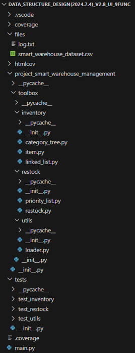

# Project 5 - Smart Warehouse Management System

## 1.Project Overview

This project revolves around the development of a smart warehouse management system aimed at optimizing the storage, retrieval, and distribution of items within a large warehouse. By leveraging data structures such as linked lists, trees, and heaps, this system ensures efficient and cohesive warehouse management.

## 2.Requirement Analysis of Project

### 2.1 Basic functional

#### 2.1.1 Inventory Management

- **Add Items to Inventory**：Support addition of new items containing: unique item ID, name, category, quantity, and priority level.

- **Remove Items from Inventory**：Enable removal of items via item ID, updating the inventory list accordingly.

- **Update Item Quantities**：Allow updates to the quantity of existing items, with validations to ensure non-negative quantities.

- **Find Items by Name and Category**：Provide search functionality for items by name, with additional category-based filtering.

#### 2.1.2 Data Loading

- **Load Data from CSV**：Load initial inventory data from a CSV file, handling any errors gracefully.

- **Initialize Data Structures**：Initialize the linked list for inventory management and a tree for storage optimization upon data loading.

#### 2.1.3 Storage Optimization

- **Categorize Items**：Categorize items into a tree structure, enabling retrieval through category navigation.

- **Efficient Item Retrieval**：Ensure efficient retrieval of items by category and item ID.

#### 2.1.4 Restock Prediction

- **Identify Low-Quantity Items**：Traverse inventory to find items with quantities below a predefined threshold.

- **Prioritize Restocking**：Insert low-quantity items into a priority heap based on their priority level, generating a prioritized restock list.

#### 2.1.5 User Interface

- **Inventory Management Interface**: Provides an interface for adding, removing, updating, and searching items, displaying current inventory details.

- **Restock List Display**：Display the restock list, indicating priority levels and current quantities.

### 2.2 Extra features

- **Right-click Functionality**: Right-click item in the interface to delete and update his inventory
  
- **Log**: A log button has been added to the interactive interface to make it easy to view the operation of the item

## 3.Design of Project

The data structures we use in the project include linked lists, trees, and heaps. Firstly, we installed extensions to Python, Rainbow CSV, Code Runner, and Coverage Gutters in VsCode.The following image shows our directory file structure:

    

### Linked List

We designed a basic singly linked list supporting:

- Addition
- Removal
- Update
- Sorting
- Iteration

Linked lists offer fast insertion and deletion but slower search and sorting.

### Storage Optimization

To optimize storage, we:

1. Categorized products into a tree by category.
2. Used linked lists to store multiple products under each category.

Recursive operations ensure the efficiency and correctness of the tree structure, enabling rapid search and sorting.

### Tree Structure

Within our tree structure, we implemented some methods:

- Search by ID
- Search by category
- Search by name
- Update item quantity

### Minimum Heap

We implemented a minimum heap to support:

- Insertion
- Extraction of minimum elements
- Checking for emptiness

This facilitates priority queues, task scheduling, and complete replenishment predictions.

### GUI Integration

Finally, we integrated these functionalities into a GUI interface within the main function. Creating a GUI interface using the tkenter library.This interface allows users to:

- Add, delete, modify, and query warehouse items
- Predict replenishments
- Ensure data persistence
- Interact seamlessly via button clicks

This enhances both functionality and user experience.

The following is a screenshot of our designed main interface:

    

